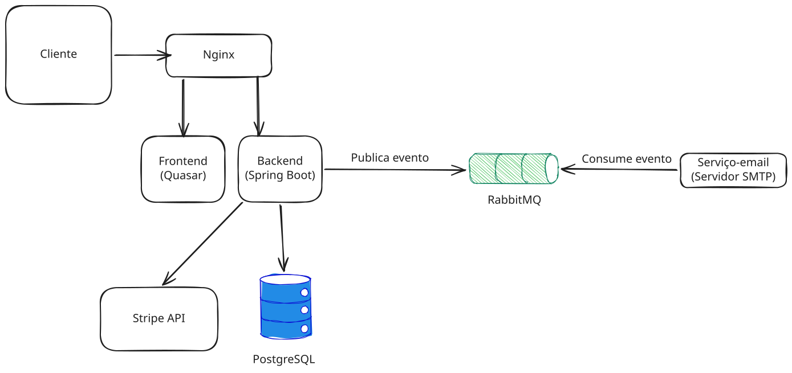

# NoTUB

**NoTUB - Transportes Urbanos de Braga** - Sistema de bilhetica para transportes publicos urbanos.

Projeto pratico de **Projeto em Engenharia de Aplicacoes** (MEI - Edicao 25/26, Universidade do Minho).

---

## Arquitetura



- **Frontend:** Vue 3 + Quasar Framework (PWA)
- **Backend:** Spring Boot 4 (Java 25) + JWT + OAuth2 Google + Stripe
- **Base de Dados:** PostgreSQL 18 (com seed data de 4400+ paragens reais de Singapura)
- **Reverse Proxy:** Caddy 2 (HTTPS automatico, load balancer)
- **Eventos:** RabbitMQ (email assincrono + notificacoes motorista via WebSocket/STOMP)
- **Microservico Email:** Spring Boot (Mailtrap SMTP)
- **Pagamentos:** Stripe Checkout Sessions
- **Tempo Real:** WebSocket (STOMP) para interface do motorista

---

## Funcionalidades Implementadas

### Gestao de Utilizadores e Autenticacao
- Registo com email/password (campos: nome, NIF, data nascimento)
- Login com email/password (JWT - 24h de validade)
- Login com Google OAuth2 (cria conta automaticamente se nao existir)
- Recuperacao de password via email (token UUID, 30 min TTL)
- Email de boas-vindas ao registar (via RabbitMQ + Mailtrap)
- Edicao de perfil (nome, NIF, data nascimento, password)
- Completar perfil apos Google OAuth2 (data nascimento obrigatoria, NIF opcional com "Nao tenho NIF")
- NIF unico na base de dados (`@Column(unique = true)`), multiplos NULLs permitidos
- Logout (limpa JWT + invalida sessao OAuth2 no backend)
- Roles: `ADMINISTRADOR`, `UTILIZADOR`, `MOTORISTA`
- Tipo de utilizador: `CRIANCA`, `ESTUDANTE`, `ADULTO`, `SENIOR`

### Gestao de Titulos de Transporte (Bilhetica)
- Compra de bilhetes individuais (1 ou mais)
- Compra de passes (H24, H48, H72, Semanal, Mensal, Anual)
- Pagamento via Stripe Checkout Sessions
- Precos dinamicos por tipo de utilizador, modalidade e numero de zonas
- Titulos associados a zonas (ManyToMany)
- Bilhete marcado como usado apos validacao

### Utilizacao de Titulos e Validacao (Check-in/Check-out)
- Leitura de QR Code (camera real via html5-qrcode)
- Suporte multi-formato QR: JSON, URL params, comma-separated, raw text
- Inicio de viagem: selecionar titulo + paragem de entrada + viagem de veiculo
- Fim de viagem: selecionar paragem de saida
- Validacao de titulo (Strategy pattern: `EstrategiaValidacao` -> `ValidacaoQRCode`)
- Atribuicao automatica de pontos por viagem (10 pts) e por compra (5 pts)

### Sistema de Pontos
- Acumulacao: 10 pts/viagem, 5 pts/compra
- Historico de pontos com tipos: VIAGEM, COMPRA, RESGATE
- Tiers: Bronze (<100), Silver Explorer (<300), Gold Navigator (<500), Platinum Legend
- Resgate: 100 pontos = 1 bilhete gratis

### Painel de Administracao
- Dashboard com estatisticas (utilizadores, bilhetes, passes, veiculos, transaccoes, viagens)
- Gestao de utilizadores (listar, promover/despromover admin, apagar)
- Gestao de veiculos (CRUD: matricula, lugares, lotacao)
- Gestao de tarifas (CRUD: valor, tipo utilizador, modalidade, zonas)
- Gestao de zonas (CRUD)
- Gestao de viagens de veiculo (criar, apagar)
- Gestao da rede de transportes (CRUD de linhas, trajetos, paragens)

### PWA (Progressive Web App)
- Service Worker com Workbox (GenerateSW)
- Instalavel no telemovel (manifest.json)
- App shortcuts: "Comprar Bilhete" e "Ler QR"
- Cache offline de assets e Google Fonts

### Interface do Motorista (Tempo Real)
- Painel dedicado em `/driver` (acesso com role `MOTORISTA`)
- Selecao de autocarro para monitorizar
- Notificacoes em tempo real via WebSocket (STOMP over SockJS)
- Indicador verde/vermelho com nome do passageiro e tipo de titulo
- Contador de validacoes (validas/recusadas) por sessao
- Historico das ultimas 50 validacoes na sessao
- Validacao automatica de bilhetes/passes ao iniciar viagem (integrado no `ViagemService`)

### Planeamento de Rotas
- Pagina dedicada em `/routes` com seletores de origem/destino
- Algoritmo Dijkstra com peso por tempo (`tempoDesdeInicio` dos PontosDePassagem)
- Resultado com segmentos por linha, paragens intermedias, duracao e numero de trocas
- API: `GET /api/network/route?from={paragemId}&to={paragemId}`
- Deteccao automatica de transferencias entre linhas em paragens partilhadas

### Verificacao Geografica (GPS)
- Validacao de proximidade do utilizador a paragem ao fazer check-in
- Formula de Haversine com raio maximo de 500m
- API: `POST /api/geo/verificar` com `{ paragemId, latitude, longitude }`
- Integrado no `BoardingDialog` - usa `navigator.geolocation` do browser
- Skip automatico se GPS indisponivel (graceful degradation)

---

## Bugs Conhecidos (Corrigidos)

| Bug | Causa | Fix |
|-----|-------|-----|
| `SyntaxError: JSON.parse` na TripsPage | Referencia circular JPA: `ViagemUtilizador` <-> `ViagemVeiculo` causava recursao infinita na serializacao JSON | Refactor completo para DTOs com mappers estaticos |
| `GET /api/viagens/utilizador` retornava viagens de TODOS os utilizadores | `ViagemService.getAllViagensUtilizador()` fazia `findAll()` sem filtro | `@AuthenticatedUser` + query JPQL polimorfica |
| `sendBeacon('/logout')` criava JSESSIONID fantasma | Pedia logout na chain errada (STATELESS em vez da chain OAuth2) | Removido logout do frontend; sessao invalidada no `OAuth2AuthenticationSuccessHandler` |

---

## Funcionalidades que Precisam de Melhoramento

- **Pagamentos:** O callback do Stripe retorna apenas `true` e `transactionId`. Ideal seria webhooks mas precisam de IPs fixos. O `TicketController` tem endpoints `/comprar` que bypassam o pagamento (criam titulos directamente).
- **QR Code real:** Atualmente o QR scanner le o codigo mas o "inicio de viagem real" usa um simulador na HomePage (dropdowns). Nao ha integracao com o autocarro fisico.
- **Horarios em tempo real:** A informacao de horarios depende dos dados estaticos do seed SQL. Nao ha actualizacao em tempo real da posicao dos autocarros.
- **Lotacao do autocarro:** O `TravelingPage` mostra lotacao hardcoded. O backend tem endpoint para actualizar lotacao (`PUT /api/veiculos/{id}/lotacao`) mas nao e integrado.
- **Google OAuth redirect URIs:** Precisam de ser configurados tanto no Google Cloud Console como no `.env` (`FRONTEND_URL`). Para desenvolvimento local, mudar para `https://localhost`.

---

## TODO

### Alta Prioridade
- [ ] **Verificacao geografica anti-fraude** - Deteccao de viagens impossiveis (distancia+tempo entre duas validacoes)

### Media Prioridade
- [ ] **Historico de Viagens** - Verificar se a pagina TripsPage mostra correctamente todas as viagens do utilizador apos o fix
- [ ] **Mapa/Visualizacao de Paragens** - As paragens tem lat/lng mas nao ha mapa na interface
- [ ] **Refresh Token** - Implementar rotacao de refresh tokens
- [ ] **Actualizar PIM** - O PIM (Visual Paradigm) precisa de ser actualizado para incluir: `ViagemVeiculo`, `Tarifa`, `Transacao`, `HistoricoPontos`, `TokenRecuperacaoSenha`, `Point` (embeddable), enums adicionais

### Baixa Prioridade
- [ ] **Deploy Kubernetes (K8s)** - Orquestracao para producao com auto-scaling
- [ ] **Docker multi-stage no servico-email** - Reduzir tamanho da imagem (actualmente inclui Maven + JDK completo)
- [ ] **Templates de email externos** - Thymeleaf/Mustache em vez de HTML inline em Java
- [ ] **Testes unitarios e de integracao** - Frontend e backend

---

## Middlewares e Padroes

### Middlewares (Backend)
- **`AuthTokenFilter`** - Extrai e valida JWT do header `Authorization: Bearer <token>` em cada request
- **`AuthEntryPointJwt`** - Retorna 401 para requests nao autenticadas
- **`OAuth2AuthenticationSuccessHandler`** - Processa login Google, cria utilizador se necessario, gera JWT, invalida sessao
- **`OAuth2AuthenticationFailureHandler`** - Redirect para signin com erro
- **`AuthenticatedUserArgumentResolver`** - Resolve `@AuthenticatedUser Utilizador` nos controllers
- **`WebSocketConfig`** - STOMP over SockJS endpoint `/ws` com SimpleBroker `/topic`

### Padroes Arquitecturais
- **Strategy Pattern** - Validacao de titulos: `EstrategiaValidacao` (interface) -> `ValidacaoQRCode` (implementacao) -> `GestorValidacao` (contexto)
- **Strategy Pattern** - Pagamentos: `PaymentProcessor` (interface) -> `StripePaymentProcessor` -> `PaymentProcessorFactory` (auto-descobre beans)
- **Command Pattern** - Microservico email: `ComandoEvento` (interface) -> `ComandoUtilizadorCriado`, `ComandoRecuperacaoPassword` -> `RegistoComandos` (registo auto-descoberto)
- **Observer Pattern** - Eventos de pagamento: `PagamentoConfirmadoEvent` / `PagamentoRejeitadoEvent` -> `PagamentoEventListener`
- **Custom Argument Resolution** - `@AuthenticatedUser` annotation para injecao limpa nos controllers
- **Multi-chain Security** - Duas filter chains ordenadas: OAuth2 chain (com sessao) e API chain (stateless JWT)
- **JOINED Inheritance** - `TituloTransporte` -> `Bilhete`/`Passe`, `Veiculo` -> `Autocarro` (extensivel para novos tipos)
- **Factory Pattern** - `PaymentProcessorFactory` auto-descobre providers via Spring DI
- **Observer Pattern** - `NotificacaoValidacaoService` publica eventos WebSocket via `SimpMessagingTemplate` para topicos `/topic/bus.{veiculoId}`
- **Dijkstra** - `RoutePlanningService` implementa caminho mais curto no grafo de paragens/trajetos com peso por `tempoDesdeInicio`
- **Geo Verification** - `GeoVerificationService` usa formula de Haversine para validar proximidade GPS (raio 500m)

---

## PIM (Platform Independent Model)

O PIM foi modelado no Visual Paradigm (`diagramas (visual-paradigm)/PIM_NOTub_v2.xml`) e contem as seguintes entidades:

### Entidades PIM
`Utilizador`, `TipoUtilizador` (enum), `TituloTransporte`, `Passe`, `Bilhete`, `Zona`, `Paragem`, `Trajeto`, `Linha`, `Autocarro`, `PontosDePassagem`, `Viagem`, `Direcao` (enum), `EstadoViagem` (enum)

### O que a implementacao tem alem do PIM
| Entidade/Conceito | Descricao |
|-------------------|-----------|
| `Veiculo` (abstract) | Superclasse de Autocarro (extensivel para Metro, Comboio, etc.) |
| `ViagemVeiculo` | Entidade intermedia: viatura percorrendo um trajeto num dado momento |
| `ViagemUtilizador` | Viagem do utilizador (separada de ViagemVeiculo) |
| `Tarifa` | Tabela de precos por tipo/modalidade/zona |
| `Transacao` | Registo de pagamentos Stripe |
| `HistoricoPontos` | Historico de acumulacao/resgate de pontos |
| `TokenRecuperacaoSenha` | Tokens para recuperacao de password |
| `Point` (embeddable) | Coordenadas GPS (lat/lng) em Paragem e Veiculo |
| Enums adicionais | `ModalidadePasse`, `AuthMethod`, `TipoPapel`, `EstadoPagamento`, `MetodoPagamento`, `TipoProduto` |

---

## Configuracao

### Para Desenvolvimento Local

**1.** Mudar no `.env` (root do projecto):
```
FRONTEND_URL=https://localhost
CADDY_DOMAIN=localhost
```

**2.** Mudar no `servico-email/.env`:
```
FRONTEND_URL=https://localhost
```

**3.** No Google Cloud Console, adicionar `https://localhost/login/oauth2/code/google` como redirect URI autorizado.

**4.** Aceitar o certificado auto-assinado do Caddy no browser (gerado automaticamente para `localhost`).

### Para Producao

Manter `notub.bounceme.net` (ou o dominio real). O Caddy gera automaticamente certificados Let's Encrypt.

---

## Variaveis de Ambiente

### `.env` (root do projecto)

```bash
# Base de Dados
SPRING_DATASOURCE_URL=jdbc:postgresql://postgres:5432/notub
POSTGRES_DB=notub
POSTGRES_USER=postgres
POSTGRES_PASSWORD=postgres
POSTGRES_HOST_PORT=5433

# RabbitMQ
RABBITMQ_HOST=rabbitmq
RABBITMQ_PORT=5672
RABBITMQ_MANAGEMENT_PORT=15672
RABBITMQ_USERNAME=notub
RABBITMQ_PASSWORD=notub123
RABBITMQ_EXCHANGE=notub.email.exchange
RABBITMQ_FILA=notub.email.fila
RABBITMQ_RK_UTILIZADOR_CRIADO=UTILIZADOR_CRIADO
RABBITMQ_RK_RECUPERACAO_PASSWORD=RECUPERACAO_PASSWORD_PEDIDA

# JWT (gerar uma chave Base64 nova para producao)
JWT_SECRET=<chave-base64-256-bit>

# Google OAuth2 (criar credenciais em console.cloud.google.com)
GOOGLE_CLIENT_ID=<client-id>
GOOGLE_CLIENT_SECRET=<client-secret>
FRONTEND_URL=https://localhost

# Caddy
CADDY_DOMAIN=localhost

# Stripe (obter em dashboard.stripe.com)
STRIPE_SECRET_KEY=<sk_test_...>
STRIPE_PUBLISHABLE_KEY=<pk_test_...>
```

### `servico-email/.env`

```bash
# Mailtrap SMTP (criar conta em mailtrap.io)
MAILTRAP_PORT=2525
MAILTRAP_USERNAME=<username>
MAILTRAP_PASSWORD=<password>

# RabbitMQ (igual ao .env root)
RABBITMQ_HOST=rabbitmq
RABBITMQ_PORT=5672
RABBITMQ_USERNAME=notub
RABBITMQ_PASSWORD=notub123
RABBITMQ_EXCHANGE=notub.email.exchange
RABBITMQ_FILA=notub.email.fila
RABBITMQ_RK_UTILIZADOR_CRIADO=UTILIZADOR_CRIADO
RABBITMQ_RK_RECUPERACAO_PASSWORD=RECUPERACAO_PASSWORD_PEDIDA

FRONTEND_URL=https://localhost
```

---

## Caddyfile

O Caddyfile usa a variavel `{$CADDY_DOMAIN:localhost}` que e injectada pelo Docker Compose. Para desenvolvimento local, usa `localhost` (certificado auto-assinado automatico). Para producao, mudar `CADDY_DOMAIN` no `.env` para o dominio real e o Caddy obtem certificados Let's Encrypt automaticamente.

Rotas com proxy para o backend:
- `/api/*` - API REST
- `/oauth2/authorization/*` - Inicio do fluxo Google OAuth2
- `/login/oauth2/*` - Callback do Google OAuth2
- `/ws/*` - WebSocket (STOMP over SockJS)

---

## Dataset / Seed Data

O seed data e gerado automaticamente a partir do dataset [UrbanBus](https://github.com/ableyyyx/UrbanBus) (dados reais de autocarros de Singapura, marco 2018) e carregado **automaticamente** pelo Spring Boot (`data.sql`) apos o Hibernate criar o schema.

### Conteudo

| Entidade | Quantidade |
|----------|------------|
| Zonas | 4 (Norte, Centro, Sul, Oeste) |
| Paragens | ~4400 (com coordenadas GPS reais de Singapura) |
| Linhas | ~440 (nomeadas Linha 1-N a partir de `BusRoutes.pickle`) |
| Trajetos | ~880 (IDA + VOLTA por linha) |
| Pontos de Passagem | ~31000 (com horarios e tempo acumulado) |
| Autocarros | ~880 (matriculas SG-XXX-NN) |
| Tarifas | 112 (bilhetes + passes por tipo/modalidade/zona) |

### Precos dos Bilhetes
| Tipo | 1 Zona | 2 Zonas | 3 Zonas | 4 Zonas |
|------|--------|---------|---------|---------|
| Adulto | 1.50 EUR | 2.20 EUR | 3.00 EUR | 3.80 EUR |
| Crianca | 0.75 EUR | 1.10 EUR | 1.50 EUR | 1.90 EUR |
| Estudante | 1.00 EUR | 1.50 EUR | 2.00 EUR | 2.50 EUR |
| Senior | 0.75 EUR | 1.10 EUR | 1.50 EUR | 1.90 EUR |

### Precos dos Passes
| Modalidade | Adulto (1Z / 4Z) | Estudante (1Z / 4Z) | Crianca (1Z / 4Z) | Senior (1Z / 4Z) |
|------------|-------------------|----------------------|--------------------|-------------------|
| H24 | 4.50 / 10.00 | 3.00 / 6.50 | 2.50 / 5.00 | 2.50 / 5.00 |
| H48 | 8.00 / 18.00 | 5.50 / 12.00 | 4.00 / 9.00 | 4.00 / 9.00 |
| H72 | 11.00 / 24.00 | 7.50 / 16.00 | 5.50 / 12.00 | 5.50 / 12.00 |
| Semanal | 22.00 / 48.00 | 15.00 / 32.00 | 11.00 / 24.00 | 11.00 / 24.00 |
| Mensal | 40.00 / 85.00 | 25.00 / 55.00 | 20.00 / 43.00 | 20.00 / 43.00 |
| Anual | 400.00 / 850.00 | 250.00 / 550.00 | 200.00 / 430.00 | 200.00 / 430.00 |

### Regenerar o seed data
```bash
cd backend/notub
python generate_seed.py
```

O script le `BusRoutes.pickle` e `BusStopList.csv` do diretorio de datasets e gera `src/main/resources/data.sql`. Os dados sao carregados automaticamente na proxima inicializacao do backend via `spring.jpa.defer-datasource-initialization=true`.

---

## Como Executar

### 1. Verificar portas
Garantir que as portas `80`, `443` estao livres.

### 2. Configurar
Criar o `.env` na root e `servico-email/.env` (ver seccao "Variaveis de Ambiente").

### 3. Arrancar
```bash
docker-compose up --build
```

### 4. Acessar
- App: `https://localhost` (ou `https://notub.bounceme.net`)
- Admin default: `admin@notub.pt` / `admin123`
- Motorista default: `motorista@notub.pt` / `motorista123`
- RabbitMQ Management: `http://localhost:15672` (notub/notub123)

O seed data (paragens, linhas, trajetos, tarifas, autocarros) e carregado automaticamente. Nao e necessario carregar dados manualmente.

### Comandos uteis
```bash
# Parar e remover containers e volumes
docker-compose down -v

# Ver logs
docker-compose logs -f backend

# Reconstruir so um servico
docker-compose up --build -d backend
```

---

## Estrutura do Projecto

```
ProjetoEA/
  .env                          # Variaveis de ambiente principais
  docker-compose.yml            # Orquestracao de todos os servicos
  caddy/
    Caddyfile                   # Reverse proxy config (parametrizavel)
    Dockerfile                  # Build frontend + Caddy
  frontend/
    NoTUB_Frontend/             # Vue 3 + Quasar PWA
      src/
        pages/                  # Paginas (Home, Trips, Tickets, QR, Account, Admin, Driver, Routes, OAuth2)
        stores/                 # Pinia stores (auth, tickets, viagens, admin, driver)
        components/             # BoardingDialog, BrandHeader, AppTabBar, TermsModal
        layouts/                # MainLayout, AuthLayout, AdminLayout, DriverLayout
        router/                 # Vue Router com guards (auth, admin, driver)
      src-pwa/                  # Service Worker + manifest.json
      quasar.config.js          # Config Quasar/Vite/PWA
  backend/
    notub/
      src/main/java/pt/notub/
        auth/                   # AuthController, OAuth2 handlers, JWT, DTOs (5)
        user/                   # UtilizadorController, UtilizadorService, DTOs (3)
        ticket/                 # TicketController, TicketService, DTOs (6)
        trip/                   # ViagemController, ViagemService (4)
        driver/                 # DriverController (3)
        network/                # NetworkController, RoutePlanningService, DTOs (10)
        vehicle/                # VeiculoController, VeiculoService (3)
        tariff/                 # TarifaController, TarifaService, DTOs (3)
        zone/                   # ZonaController, ZonaService (3)
        points/                 # ServicoPontos, HistoricoPontosController (3)
        validation/             # ValidacaoController, GestorValidacao, Estrategias (7)
        transaction/            # TransacaoController, TransacaoService (3)
        payment/                # PagamentoController, PagamentoService, Stripe (15)
        admin/                  # AdminControllers (8)
        notification/           # PublicadorEventosEmail, NotificacaoValidacaoService (1)
        common/mapper/          # Mappers estaticos (DTOs sem Jackson nas entidades) (13)
        models/                 # Entidades JPA (27) + Enums (11)
        repositories/           # Spring Data JPA (16)
        security/               # JWT + OAuth2 config (10)
        config/                 # RabbitMQ, WebSocket, DataInitializer, WebMvc (4)
        exception/              # GlobalExceptionHandler (2)
      src/main/resources/
        application.properties  # Config Spring Boot (tudo via env vars)
        data.sql                # Seed data auto-gerado (38K+ linhas, 5MB)
      generate_seed.py          # Gerador de seed data a partir do UrbanBus
      Dockerfile                # Multi-stage Maven build
  servico-email/
    .env                        # Credenciais Mailtrap + RabbitMQ
    src/                        # Spring Boot consumer (Command pattern)
    Dockerfile                  # Single-stage (a melhorar)
  tests/
    jmeter/
      notub_load_test.jmx       # Plano de testes de carga (5 patamares)
      README.md                 # Instrucoes para executar testes
  diagramas (visual-paradigm)/
    PIM_NOTub_v2.xml            # PIM do Visual Paradigm
```
